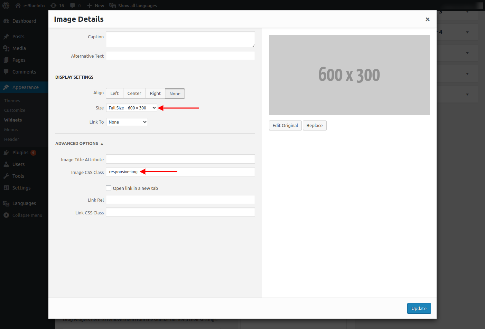

How to add community banners
----------------------------

1. Go to `Appearance >> Widgets` in the WordPress administrative area
2. For each banner, choose a **text widget** and place it in the respective e-BlueInfo Sidebar
3. In the text widget, choose the option **Add Media**
4. For the banner to be displayed correctly, when including the image, set the size to `Full Size` and include the `responsive-img` class in the **Image CSS Class** field

Banner specifications:
- Format: JPG or PNG
- Height: 300px
- Width: 600px