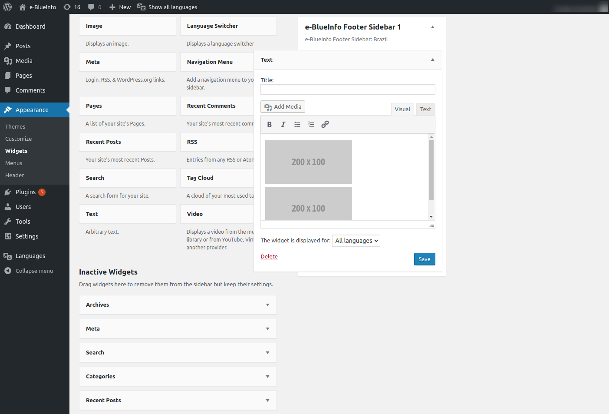

How to add images of institutional supporters
---------------------------------------------

1. Go to `Appearance >> Widgets` in the WordPress administrative area
2. Choose a **text widget** and place it in the respective e-BlueInfo Footer Sidebar
3. In the text widget, choose the **Add Media** option and include the images

Image specifications:
- Format: JPG or PNG
- Height: 100px
- Width: 200px